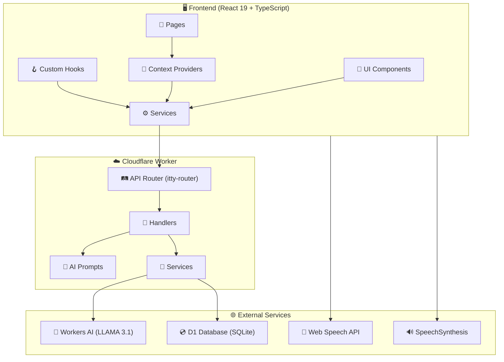
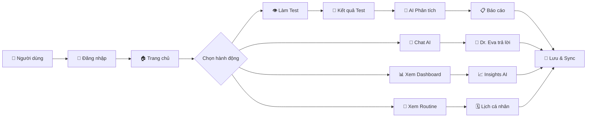
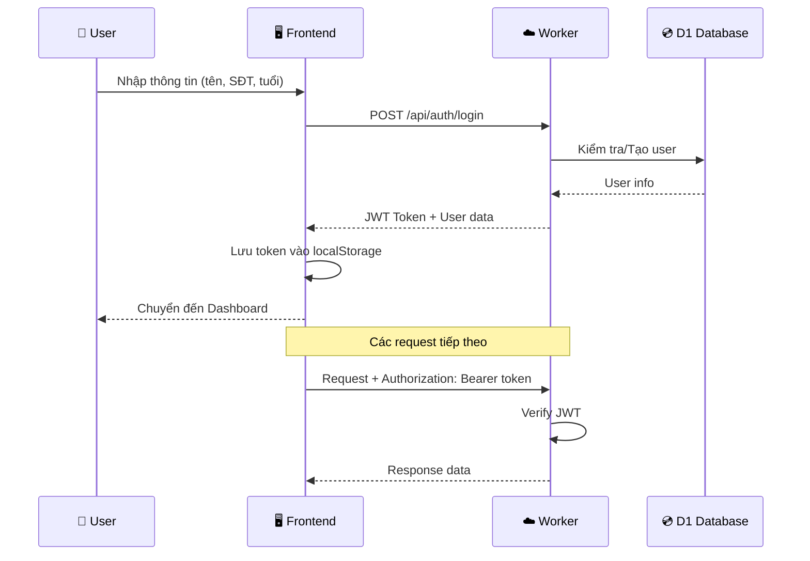
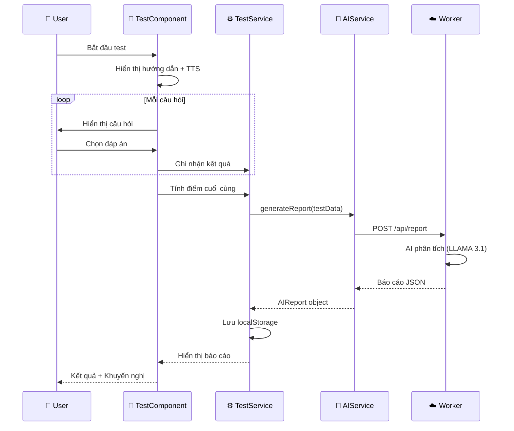
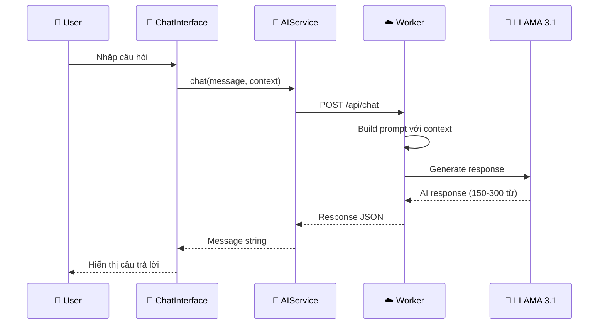

# 👁️ Vision Coach - Nền Tảng Chăm Sóc Sức Khỏe Mắt AI

<div align="center">


**Ứng dụng web toàn diện cho kiểm tra, giám sát và tư vấn sức khỏe mắt được hỗ trợ bởi AI**

🎯 **100% MIỄN PHÍ** - Không cần API key  
🚀 **Cloudflare Workers AI** - LLAMA 3.1 8B  
👩‍⚕️ **Dr. Eva** - Tiến sĩ Nhãn khoa với 20 năm kinh nghiệm

[🌐 Demo](https://slht4653.testaivision.pages.dev) • [👨‍💼 Admin Dashboard](./admin-standalone.html) • [🐛 Báo lỗi](https://github.com/LongNgn204/testaivission/issues)

</div>

---

## 📑 Mục Lục

- [✨ Tính Năng](#-tính-năng-chính)
- [🏗️ Kiến Trúc Hệ Thống](#️-kiến-trúc-hệ-thống)
- [📁 Cấu Trúc Thư Mục](#-cấu-trúc-thư-mục-chi-tiết)
- [🔄 Luồng Hoạt Động](#-luồng-hoạt-động)
- [🚀 Cài Đặt](#-cài-đặt-nhanh)
- [📚 API Endpoints](#-api-endpoints)
- [🛠️ Công Nghệ](#️-công-nghệ)
- [🔒 Bảo Mật](#-bảo-mật)
- [📈 Changelog](#-changelog)

---

## ✨ Tính Năng Chính

### 👁️ 5 Bài Test Thị Lực Chuyên Nghiệp

| Test | Mô tả | Phát hiện | Thời gian |
|------|-------|-----------| ----------|
| **Snellen Chart** | Đo thị lực với chữ E xoay ngẫu nhiên | Cận thị, viễn thị | ~3 phút |
| **Ishihara Plates** | 14 bảng màu Ishihara chuẩn | Mù màu đỏ-xanh | ~5 phút |
| **Amsler Grid** | Lưới kiểm tra điểm vàng | Thoái hóa điểm vàng (AMD) | ~3 phút |
| **Astigmatism Dial** | Biểu đồ tia xoay cho từng mắt | Loạn thị | ~3 phút |
| **Duochrome Test** | Bảng hai màu đỏ-xanh | Cận thị / Viễn thị | ~3 phút |

### 🤖 Trợ Lý AI - Tiến Sĩ Bác Sĩ Eva (100% MIỄN PHÍ)

| Tính năng | Mô tả | Chi phí |
|-----------|-------|---------|
| 💬 **Chat văn bản** | Hỏi đáp y khoa với 150-300 từ chi tiết | **$0** |
| 🎤 **Chat giọng nói** | Điều khiển bằng giọng nói | **$0** |
| 📊 **Báo cáo AI** | Phân tích 400-500 từ + 12-15 khuyến nghị | **$0** |
| 📅 **Lịch tập hàng tuần** | Routine chăm sóc mắt cá nhân hóa | **$0** |
| 💡 **Mẹo chủ động** | Lời khuyên 50-70 từ có cơ sở khoa học | **$0** |
| 🔊 **Đọc hướng dẫn** | TTS cho hướng dẫn test | **$0** |

### 📊 Dashboard & Báo Cáo

- 🎯 **Điểm số sức khỏe mắt** với phân tích 80-120 từ
- 📈 **Lịch sử test** với so sánh tiến bộ
- 📋 **Lịch trình chăm sóc** cá nhân hóa
- 📄 **Xuất PDF** báo cáo chi tiết

---

## 🏗️ Kiến Trúc Hệ Thống



---

## 🔄 Luồng Hoạt Động

### 📋 Quy Trình Tổng Quan



### 🔐 Quy Trình Xác Thực



### 🧪 Quy Trình Làm Test



### 💬 Quy Trình Chat AI



---

## 📁 Cấu Trúc Thư Mục Chi Tiết

```
testaivission/
│
├── 📄 index.html                 # Entry point HTML
├── 📄 index.tsx                  # React entry point
├── 📄 index.css                  # Global styles + Tailwind
├── 📄 App.tsx                    # Main React App component
├── 📄 types.ts                   # TypeScript type definitions
├── 📄 manifest.json              # PWA manifest
├── 📄 sw.js                      # Service Worker
├── 📄 admin-standalone.html      # Admin Dashboard (standalone)
│
├── 📁 components/                # React UI Components (24 files)
│   ├── 📁 ui/                    # Shared UI components
│   │   ├── GlassCard.tsx         # Glassmorphism card
│   │   └── PageShell.tsx         # Page wrapper
│   │
│   ├── 📁 vision-coach/          # AI Chat components
│   │   ├── ChatInterface.tsx     # Text chat với Dr. Eva
│   │   └── VoiceInterface.tsx    # Voice chat interface
│   │
│   ├── 🧪 SnellenTest.tsx        # Snellen chart test
│   ├── 🧪 ColorBlindTest.tsx     # Ishihara plates test
│   ├── 🧪 AmslerGridTest.tsx     # AMD detection test
│   ├── 🧪 AstigmatismTest.tsx    # Astigmatism dial test
│   ├── 🧪 DuochromeTest.tsx      # Myopia/Hyperopia test
│   │
│   ├── 📊 DashboardContent.tsx   # Dashboard with insights
│   ├── 📊 HealthDashboard.tsx    # Health overview
│   ├── 📋 ReportDisplayContent.tsx # Report viewer
│   ├── 📋 AIReportVerifier.tsx   # Report verification
│   │
│   ├── 🎯 Header.tsx             # Navigation header
│   ├── 🎯 TestShell.tsx          # Test wrapper component
│   ├── 🎯 FeatureSlider.tsx      # Feature carousel
│   ├── 🗺️ HospitalLocator.tsx   # Find nearby hospitals
│   ├── 🎓 TourGuide.tsx          # Onboarding tour
│   ├── 👤 UserInfo.tsx           # User profile display
│   └── 🔒 ProtectedRoute.tsx     # Auth guard
│
├── 📁 pages/                     # Page Components (9 files)
│   ├── 🏠 Home.tsx               # Dashboard chính
│   ├── 👋 WelcomePage.tsx        # Trang chào mừng
│   ├── 🔐 AuthPage.tsx           # Đăng nhập/Đăng ký
│   ├── ⚙️ PersonalizedSetupPage.tsx # Thiết lập ban đầu
│   ├── 📊 ProgressPage.tsx       # Tiến trình & thống kê
│   ├── 📜 History.tsx            # Lịch sử test
│   ├── 🏥 HealthProfile.tsx      # Hồ sơ sức khỏe
│   ├── ⏰ RemindersPage.tsx      # Lịch nhắc nhở
│   └── ℹ️ AboutPage.tsx          # Giới thiệu
│
├── 📁 services/                  # Business Logic (11 files)
│   ├── 🤖 aiService.ts           # AI chat, report, routine, tip
│   ├── 💬 chatbotService.ts      # Chatbot API calls
│   ├── 🔐 authService.ts         # JWT auth & user management
│   ├── 💾 storageService.ts      # LocalStorage management
│   ├── 🔄 syncService.ts         # Backend data sync
│   ├── ⏰ reminderService.ts     # Notification reminders
│   │
│   ├── 👁️ snellenService.ts     # Snellen test logic
│   ├── 🎨 colorBlindService.ts   # Colorblind test logic
│   ├── 📐 amslerGridService.ts   # Amsler test logic
│   ├── 🔄 astigmatismService.ts  # Astigmatism test logic
│   └── 🔴🟢 duochromeService.ts  # Duochrome test logic
│
├── 📁 context/                   # React Context Providers (6 files)
│   ├── 🌐 LanguageContext.tsx    # i18n (vi/en)
│   ├── 🌙 ThemeContext.tsx       # Dark/Light mode
│   ├── 👤 UserContext.tsx        # User state management
│   ├── 📅 RoutineContext.tsx     # Weekly routine state
│   ├── 🎤 VoiceControlContext.tsx # Voice permissions
│   └── 🎓 TourGuideContext.tsx   # Onboarding state
│
├── 📁 hooks/                     # Custom React Hooks (3 files)
│   ├── 📊 useDashboardInsights.ts # Dashboard AI insights
│   ├── 📄 usePdfExport.ts        # PDF report export
│   └── 🎤 useSpeechRecognition.ts # Voice input hook
│
├── 📁 utils/                     # Utility Functions (4 files)
│   ├── 🔊 audioUtils.ts          # Audio playback helpers
│   ├── 📦 dataMigration.ts       # Data migration utilities
│   ├── ⚙️ envConfig.ts           # Environment config
│   └── 🚀 performanceUtils.ts    # Performance optimizations
│
├── 📁 i18n/                      # Internationalization
│   └── index.ts                  # Translation strings (vi/en)
│
├── 📁 worker/                    # Cloudflare Worker Backend
│   ├── 📄 wrangler.toml          # Worker config
│   │
│   └── 📁 src/
│       ├── 📄 index.ts           # API router & CORS
│       ├── 📄 types.ts           # Backend type definitions
│       │
│       ├── 📁 handlers/          # API Handlers (9 files)
│       │   ├── 🔐 auth.ts        # Login/Verify/Logout
│       │   ├── 💬 chat.ts        # AI chat endpoint
│       │   ├── 📊 aiReport.ts    # Report generation
│       │   ├── 📅 routine.ts     # Weekly routine
│       │   ├── 💡 proactiveTip.ts # Health tips
│       │   ├── 📈 dashboard.ts   # Dashboard insights
│       │   ├── 🔄 sync.ts        # Data sync
│       │   ├── 👨‍💼 admin.ts       # Admin API
│       │   └── 🤖 adminAssistant.ts # Admin AI helper
│       │
│       ├── 📁 prompts/           # AI Prompt Templates (5 files)
│       │   ├── 💬 chat.ts        # Dr. Eva chat prompts
│       │   ├── 📊 report.ts      # Report analysis prompts
│       │   ├── 📈 dashboard.ts   # Dashboard analysis prompts
│       │   ├── 💡 proactiveTip.ts # Health tip prompts
│       │   └── 📅 routine.ts     # Routine generation prompts
│       │
│       ├── 📁 services/          # Backend Services (3 files)
│       │   ├── 🧠 gemini.ts      # AI model wrapper (LLAMA 3.1)
│       │   ├── 💾 database.ts    # D1 database operations
│       │   └── 📦 cache.ts       # Response caching
│       │
│       └── 📁 middleware/        # Middleware (3 files)
│           ├── 🔐 auth.ts        # JWT verification
│           ├── 🚦 rateLimit.ts   # Rate limiting
│           └── 📝 logger.ts      # Request logging
│
└── 📁 assets/                    # Static Assets
    ├── logo.png                  # App logo
    ├── dr_eva.png                # Dr. Eva avatar
    └── vision_tests.png          # Screenshot
```

---

## � Code Liên Kết - Ví Dụ Thực Tế

### 1️⃣ Frontend Component → Service → Worker API

```tsx
// 📄 components/vision-coach/ChatInterface.tsx
import { chat } from '../../services/aiService';

const ChatInterface = () => {
  const handleSend = async (message: string) => {
    // Gọi service layer
    const response = await chat(message, lastTestResult, userProfile, language);
    setMessages(prev => [...prev, { role: 'assistant', content: response }]);
  };
};
```

```typescript
// 📄 services/aiService.ts
import { getEnvConfig } from '../utils/envConfig';

export async function chat(
  message: string,
  lastTestResult: any,
  userProfile: any,
  language: 'vi' | 'en'
): Promise<string> {
  const config = getEnvConfig();
  
  // Gọi Worker API
  const response = await fetch(`${config.apiUrl}/api/chat`, {
    method: 'POST',
    headers: {
      'Content-Type': 'application/json',
      'Authorization': `Bearer ${token}`
    },
    body: JSON.stringify({ message, lastTestResult, userProfile, language })
  });
  
  const data = await response.json();
  return data.message;
}
```

```typescript
// 📄 worker/src/handlers/chat.ts
import { createChatPrompt } from '../prompts/chat';
import { generateWithCloudflareAI } from '../services/gemini';

export async function chat(request: IRequest, env: any) {
  const { message, lastTestResult, userProfile, language } = await request.json();
  
  // Sử dụng prompt template
  const prompt = createChatPrompt(message, lastTestResult, userProfile, language);
  
  // Gọi AI Model
  const response = await generateWithCloudflareAI(env.AI, prompt);
  
  return new Response(JSON.stringify({ message: response }));
}
```

```typescript
// 📄 worker/src/prompts/chat.ts
export function createChatPrompt(
  message: string,
  lastTestResult: any,
  userProfile: any,
  language: 'vi' | 'en'
): string {
  return language === 'vi'
    ? `Bạn là TIẾN SĨ - BÁC SĨ EVA...
       CÂU HỎI: ${message}`
    : `You are DR. EVA, MD, PhD...
       QUESTION: ${message}`;
}
```

---

### 2️⃣ Test Component → Test Service → AI Report

```tsx
// 📄 components/SnellenTest.tsx
import { generateReport } from '../services/aiService';
import { calculateSnellenScore } from '../services/snellenService';

const SnellenTest = () => {
  const handleTestComplete = async (answers: Answer[]) => {
    // Tính điểm từ test service
    const score = calculateSnellenScore(answers);
    
    // Gọi AI để tạo báo cáo
    const report = await generateReport('snellen', { score, answers }, language);
    
    // Lưu kết quả
    saveTestResult({ testType: 'snellen', resultData: { score }, report });
  };
};
```

```typescript
// 📄 services/snellenService.ts
export function calculateSnellenScore(answers: Answer[]): string {
  const correctCount = answers.filter(a => a.isCorrect).length;
  const acuity = getAcuityFromCorrect(correctCount);
  return acuity; // "20/20", "20/25", etc.
}
```

```typescript
// 📄 worker/src/handlers/aiReport.ts
import { createReportPrompt, createReportSchema } from '../prompts/report';

export async function generateReport(request: IRequest, env: any) {
  const { testType, testData, history, language } = await request.json();
  
  // Sử dụng prompt và schema
  const prompt = createReportPrompt(testType, testData, history, language);
  const schema = createReportSchema();
  
  // Generate với structured output
  const report = await generateWithCloudflareAI(env.AI, prompt, schema);
  
  return new Response(JSON.stringify(report));
}
```

---

### 3️⃣ Context Provider → Hook → Component

```tsx
// 📄 context/UserContext.tsx
export const UserProvider = ({ children }) => {
  const [user, setUser] = useState<User | null>(null);
  const [isAuthenticated, setIsAuthenticated] = useState(false);
  
  const login = async (name: string, phone: string, age: number) => {
    const response = await authService.login(name, phone, age);
    setUser(response.user);
    setIsAuthenticated(true);
  };
  
  return (
    <UserContext.Provider value={{ user, isAuthenticated, login }}>
      {children}
    </UserContext.Provider>
  );
};
```

```tsx
// 📄 hooks/useDashboardInsights.ts
import { useUser } from '../context/UserContext';
import { generateDashboardInsights } from '../services/aiService';

export function useDashboardInsights() {
  const { user } = useUser();
  const [insights, setInsights] = useState<DashboardInsights | null>(null);
  
  useEffect(() => {
    if (user) {
      const history = storageService.getTestHistory();
      generateDashboardInsights(history, language).then(setInsights);
    }
  }, [user]);
  
  return insights;
}
```

```tsx
// 📄 components/DashboardContent.tsx
import { useDashboardInsights } from '../hooks/useDashboardInsights';

const DashboardContent = () => {
  const insights = useDashboardInsights();
  
  return (
    <div>
      <ScoreCard score={insights?.score} rating={insights?.rating} />
      <TrendChart trend={insights?.trend} />
      <ProTip tip={insights?.proTip} />
    </div>
  );
};
```

---

### 4️⃣ Worker Router → Handlers → Services → Database

```typescript
// 📄 worker/src/index.ts (Router)
import { Router } from 'itty-router';
import { chat } from './handlers/chat';
import { generateReport } from './handlers/aiReport';
import { syncHistory } from './handlers/sync';

const router = Router();

router.post('/api/chat', chat);
router.post('/api/report', generateReport);
router.post('/api/sync/history', syncHistory);

export default {
  async fetch(request: Request, env: any) {
    return router.handle(request, env);
  }
};
```

```typescript
// 📄 worker/src/handlers/sync.ts
import { DatabaseService } from '../services/database';

export async function syncHistory(request: IRequest, env: any) {
  const { history } = await request.json();
  
  // Sử dụng database service
  const db = new DatabaseService(env.DB);
  
  for (const item of history) {
    await db.saveTestResult({
      user_id: decoded.userId,
      test_type: item.testType,
      test_data: JSON.stringify(item.resultData),
      score: item.score
    });
  }
  
  return new Response(JSON.stringify({ success: true, synced: history.length }));
}
```

```typescript
// 📄 worker/src/services/database.ts
export class DatabaseService {
  constructor(private db: D1Database) {}
  
  async saveTestResult(data: TestResultInput) {
    const result = await this.db.prepare(`
      INSERT INTO test_results (user_id, test_type, test_data, score, created_at)
      VALUES (?, ?, ?, ?, datetime('now'))
      RETURNING *
    `).bind(data.user_id, data.test_type, data.test_data, data.score).first();
    
    return result;
  }
  
  async getUserTestHistory(userId: string, limit: number) {
    return await this.db.prepare(`
      SELECT * FROM test_results 
      WHERE user_id = ? 
      ORDER BY created_at DESC 
      LIMIT ?
    `).bind(userId, limit).all();
  }
}
```

---

## �🚀 Cài Đặt Nhanh

### Yêu Cầu

- ✅ Node.js 18+
- ✅ npm hoặc yarn
- ✅ Cloudflare account (miễn phí)

### 1️⃣ Frontend

```bash
# Clone repository
git clone https://github.com/LongNgn204/testaivission.git
cd testaivission

# Cài đặt dependencies
npm install

# Chạy development server
npm run dev

# Build production
npm run build
```

### 2️⃣ Backend (Cloudflare Worker)

```bash
# Di chuyển vào thư mục worker
cd worker

# Cài đặt dependencies
npm install

# Tạo D1 database (chỉ lần đầu)
npx wrangler d1 create vision-coach-db

# Apply migrations
npx wrangler d1 execute vision-coach-db --file=./migrations/0001_init.sql

# Deploy to production
npx wrangler deploy

# Test locally
npx wrangler dev
```

### 3️⃣ Environment Variables

**Frontend (`.env`):**
```env
VITE_API_URL=https://vision-coach-worker.stu725114073.workers.dev
```

**Worker (`wrangler.toml`):**
```toml
[vars]
JWT_SECRET = "your-secure-jwt-secret"

[[d1_databases]]
binding = "DB"
database_name = "vision-coach-db"
database_id = "your-database-id"

[ai]
binding = "AI"
```

---

## 📚 API Endpoints

### 🔐 Authentication

| Method | Endpoint | Mô tả |
|--------|----------|-------|
| POST | `/api/auth/login` | Đăng nhập (name, phone, age) |
| POST | `/api/auth/verify` | Xác thực JWT token |
| POST | `/api/auth/logout` | Đăng xuất |

### 🤖 AI Services (FREE - LLAMA 3.1)

| Method | Endpoint | Mô tả | Response |
|--------|----------|-------|----------|
| POST | `/api/chat` | Chat với Dr. Eva | 150-300 từ |
| POST | `/api/report` | Tạo báo cáo test | 400-500 từ + 12-15 khuyến nghị |
| POST | `/api/dashboard` | Dashboard insights | 80-120 từ |
| POST | `/api/routine` | Lịch tập cá nhân | 7-day routine |
| POST | `/api/proactive-tip` | Mẹo sức khỏe | 50-70 từ |

### 👨‍💼 Admin API (Protected)

| Method | Endpoint | Mô tả |
|--------|----------|-------|
| GET | `/api/admin/users` | Danh sách người dùng |
| GET | `/api/admin/records` | Lịch sử test |
| GET | `/api/admin/stats` | Thống kê tổng hợp |

### 🔄 Data Sync

| Method | Endpoint | Mô tả |
|--------|----------|-------|
| POST | `/api/sync/pull` | Lấy dữ liệu từ server |
| POST | `/api/sync/history` | Đồng bộ lịch sử test |
| POST | `/api/sync/settings` | Đồng bộ cài đặt |

---

## 🛠️ Công Nghệ

### Frontend Stack

| Công nghệ | Phiên bản | Mô tả |
|-----------|-----------|-------|
| React | 19 | UI Framework với Concurrent Mode |
| TypeScript | 5.0 | Type safety toàn bộ codebase |
| Tailwind CSS | 3.4 | Utility-first CSS với dark mode |
| Vite | 6.4 | Lightning-fast build tool |
| React Router | 6 | Client-side routing |
| Lucide Icons | 0.548 | Icon library |

### Backend Stack

| Công nghệ | Mô tả |
|-----------|-------|
| Cloudflare Workers | Serverless edge functions (0ms cold start) |
| Workers AI | LLAMA 3.1 8B (miễn phí không giới hạn) |
| D1 Database | SQLite cloud database (5GB free) |
| itty-router | Lightweight API routing |
| JWT | Xác thực với 7 ngày expiry |

### AI Features (v2.3.0)

| Tính năng | Cũ | Mới |
|-----------|-----|-----|
| Độ dài chat | 50-80 từ | **150-300 từ** |
| Report summary | 250-300 từ | **400-500 từ** |
| Khuyến nghị | 8-10 mục | **12-15 mục chi tiết** |
| Dr. Eva | 15 năm kinh nghiệm | **20 năm + Tiến sĩ** |
| Tiêu chuẩn | Cơ bản | **WHO, AAO, AREDS2** |
| Ngôn ngữ | Có pha trộn | **Thuần túy 100%** |

---

## 🔒 Bảo Mật

| Feature | Mô tả | Status |
|---------|-------|--------|
| 🔐 **JWT Auth** | Token expiry 7 ngày | ✅ |
| 🛡️ **CSRF Protection** | Origin validation | ✅ |
| 🚫 **Rate Limiting** | 60 requests/minute | ✅ |
| 🌐 **CORS** | Whitelist domains | ✅ |
| 🔒 **XSS Prevention** | HTML escaping | ✅ |
| 📝 **Input Sanitization** | TTS text sanitization | ✅ |

---

## 📈 Changelog

### v2.3.0 (December 2024) ⭐ CURRENT

#### 🧠 AI Training Upgrade
- ✅ Dr. Eva nâng cấp lên **Tiến sĩ - Bác sĩ** với 20 năm kinh nghiệm
- ✅ Kiến thức y khoa chuẩn quốc tế: **WHO, AAO, AREDS2**
- ✅ Câu trả lời chi tiết hơn: **150-300 từ**
- ✅ Báo cáo chuyên sâu: **400-500 từ + 12-15 khuyến nghị**
- ✅ Ngôn ngữ thuần túy **100%** (không pha trộn)
- ✅ Cấu trúc chuẩn bác sĩ: Đánh giá → Phân tích → Khuyến nghị → Tiên lượng

### v2.2.0 (December 2024)

#### 🔐 Security Fixes
- ✅ Fixed XSS vulnerability in Admin Dashboard
- ✅ Added admin authentication
- ✅ Implemented CSRF protection

#### 🐛 Bug Fixes
- ✅ Fixed localStorage key mismatch
- ✅ Fixed password validation

### v2.1.0 (December 2024)

#### 🆕 New Features
- 🎤 Voice Chat miễn phí (Web Speech API)
- 📊 Admin Dashboard với D1 database
- 🧠 Enhanced AI với kiến thức nhãn khoa

---

## 📝 License

MIT License - Xem file [LICENSE](./LICENSE)

---

## 👨‍💻 Tác Giả

**Long Nguyễn**

- GitHub: [@LongNgn204](https://github.com/LongNgn204)
- Project: [testaivission](https://github.com/LongNgn204/testaivission)

---

<div align="center">

Tạo với ❤️ cho sức khỏe đôi mắt của bạn

**Last Updated**: December 2024  
**Version**: 2.3.0

</div>
