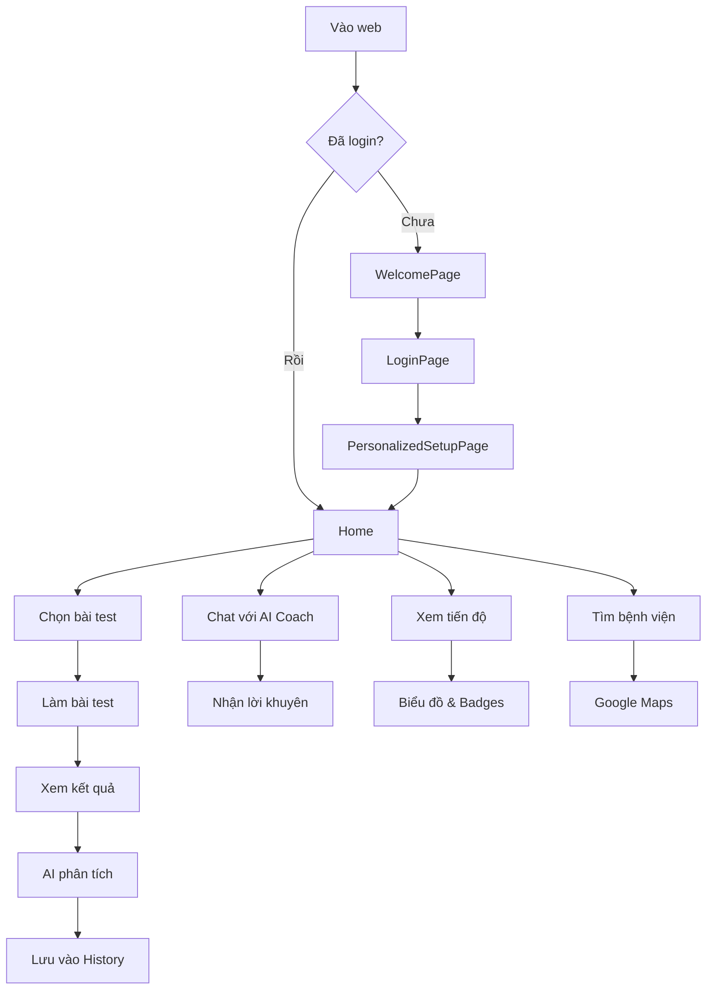
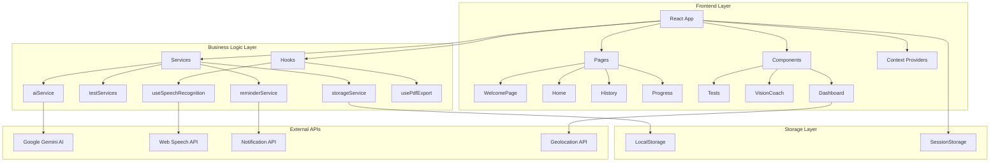

# 🏥 SƠ ĐỒ TỔNG HỢP - TRANG WEB KIỂM TRA THỊ LỰC AI

**Ngày cập nhật:** 12/11/2025  
**Phiên bản:** 2.0  
**Tech Stack:** React 19 + TypeScript + Vite + Google Gemini AI

---

## 📊 KIẾN TRÚC TỔNG QUAN

```
┌─────────────────────────────────────────────────────────────┐
│                    🌐 AI VISION TEST WEB                     │
│                  (React 19 + TypeScript)                     │
└─────────────────────────────────────────────────────────────┘
                              │
                ┌─────────────┼─────────────┐
                │             │             │
        ┌───────▼──────┐ ┌───▼────┐ ┌──────▼──────┐
        │   Frontend   │ │   AI   │ │   Services  │
        │  Components  │ │ Engine │ │   & Utils   │
        └──────────────┘ └────────┘ └─────────────┘
                │             │             │
        ┌───────┴─────────────┴─────────────┴────────┐
        │                                             │
    ┌───▼────┐  ┌────────┐  ┌──────┐  ┌──────────┐ │
    │ Pages  │  │Context │  │Hooks │  │ Storage  │ │
    └────────┘  └────────┘  └──────┘  └──────────┘ │
        │                                           │
        └───────────────────────────────────────────┘
```

---

## 🎯 CẤU TRÚC THÀNH PHẦN CHÍNH

### 1️⃣ **TRANG CHÍNH (Pages)**

```
📁 pages/
├── 🏠 Home.tsx                  # Trang chủ - Dashboard chính
├── 👋 WelcomePage.tsx           # Màn hình chào mừng đầu tiên
├── 🔐 LoginPage.tsx             # Đăng nhập/Đăng ký
├── ⚙️  PersonalizedSetupPage.tsx # Thiết lập cá nhân hóa
├── 📊 ProgressPage.tsx          # Theo dõi tiến độ với biểu đồ
├── 📜 History.tsx               # Lịch sử kiểm tra
├── ℹ️  AboutPage.tsx             # Giới thiệu về ứng dụng
└── ⏰ RemindersPage.tsx         # Quản lý nhắc nhở
```

**Luồng điều hướng:**
```
WelcomePage → LoginPage → PersonalizedSetupPage → Home
     │                                               │
     └───────────────────────────────────────────────┘
                    (Có thể bỏ qua)
```

---

### 2️⃣ **BÀI KIỂM TRA THỊ LỰC (5 Tests)**

```
📁 components/
├── 👁️  SnellenTest.tsx          # Test thị lực cơ bản (E, C, L...)
│   ├── 8 cấp độ khó (20/200 → 20/20)
│   ├── Hướng dẫn giọng nói tự động
│   └── Tính điểm tự động
│
├── 🎨 ColorBlindTest.tsx        # Test mù màu (Ishihara)
│   ├── 15 tấm hình Ishihara
│   ├── Nhận diện số trong vòng tròn
│   └── Phát hiện mù màu đỏ-xanh
│
├── 🌀 AstigmatismTest.tsx       # Test loạn thị (Bánh xe)
│   ├── Bánh xe 12 đường kẻ
│   ├── Phát hiện đường mờ/rõ
│   └── AI phân tích kết quả
│
├── 📐 AmslerGridTest.tsx        # Test lưới Amsler (Thoái hóa điểm vàng)
│   ├── Lưới 20x20 ô vuông
│   ├── Phát hiện đường cong/mờ
│   └── Cảnh báo AMD sớm
│
└── 🔴🟢 DuochromeTest.tsx       # Test đỏ-xanh (Cận/Viễn)
    ├── So sánh nền đỏ vs xanh lá
    ├── Phát hiện cận thị/viễn thị
    └── Đề xuất kính điều chỉnh
```

**Sơ đồ flow bài test:**
```
Chọn bài test → Hướng dẫn → Làm bài → Kết quả → Lưu vào History
                  ↓                      ↓
            Voice Guide          AI phân tích + Lời khuyên
```

---

### 3️⃣ **CHATBOT & AI COACH**

```
📁 components/
├── 🤖 VisionCoach.tsx           # Chatbot AI 2 chiều (Text + Voice)
│   ├── Chat Mode: Nhắn tin text
│   ├── Voice Mode: Nói chuyện giọng nói
│   ├── AI phân tích kết quả test
│   ├── Lời khuyên cá nhân hóa
│   └── Trả lời câu hỏi sức khỏe mắt
│
└── 🎤 TestInstructionsPlayer.tsx # Hướng dẫn giọng nói tự động
    ├── TTS (Text-to-Speech) tự động
    ├── Hướng dẫn từng bước
    └── Multi-language (Vi/En)
```

**Luồng hoạt động VisionCoach:**
```
User Input (Text/Voice)
        ↓
   Parse Intent
        ↓
Google Gemini AI Analysis
        ↓
AI Response (Text + TTS)
        ↓
Display Feedback + Voice Output
```

---

### 4️⃣ **CONTEXT & STATE MANAGEMENT**

```
📁 context/
├── 🌍 LanguageContext.tsx       # Đa ngôn ngữ (Vi/En)
│   └── Hỗ trợ: Tiếng Việt, English
│
├── 🎨 ThemeContext.tsx          # Dark/Light mode
│   └── Tự động theo hệ thống hoặc manual
│
├── 👤 UserContext.tsx           # Thông tin người dùng
│   ├── Tuổi, giới tính, nghề nghiệp
│   ├── Mục tiêu sức khỏe mắt
│   └── Lịch sử bệnh lý
│
├── 🔄 RoutineContext.tsx        # Lịch trình & Nhắc nhở
│   ├── Tần suất kiểm tra
│   ├── Thời gian nhắc nhở
│   └── Chuỗi streak (ngày liên tiếp)
│
└── 🎤 VoiceControlContext.tsx   # Điều khiển giọng nói (ĐÃ XÓA)
    └── ❌ Đã loại bỏ do chưa cần thiết
```

---

### 5️⃣ **SERVICES (Dịch vụ Backend)**

```
📁 services/
├── 🤖 aiService.ts              # Google Gemini AI Integration
│   ├── Chat completion
│   ├── Vision analysis
│   ├── Text-to-Speech
│   └── Health recommendations
│
├── 👁️  snellenService.ts        # Logic bài test Snellen
│   ├── Tạo câu hỏi ngẫu nhiên
│   ├── Validate câu trả lời
│   └── Tính điểm thị lực (20/200 → 20/20)
│
├── 🎨 colorBlindService.ts      # Logic test mù màu
│   ├── 15 tấm Ishihara
│   ├── Kiểm tra đáp án
│   └── Phân loại mù màu
│
├── 🌀 astigmatismService.ts     # Logic test loạn thị
│   ├── Phát hiện đường mờ
│   └── Tính độ loạn thị
│
├── 📐 amslerGridService.ts      # Logic test lưới Amsler
│   ├── Phát hiện biến dạng
│   └── Cảnh báo AMD
│
├── 🔴🟢 duochromeService.ts     # Logic test đỏ-xanh
│   ├── So sánh độ rõ
│   └── Đề xuất kính
│
├── 💾 storageService.ts         # LocalStorage wrapper
│   ├── Lưu kết quả test
│   ├── Lưu user profile
│   └── Export/Import data
│
├── ⏰ reminderService.ts        # Hệ thống nhắc nhở
│   ├── Notification API
│   ├── Scheduled reminders
│   └── Streak tracking
│
├── 🗣️ chatbotService.ts         # AI Chatbot logic
│   └── Intent recognition
│
└── 🎤 voiceCommandService.ts    # Voice Commands (ĐÃ XÓA)
    └── ❌ Đã loại bỏ do chưa cần thiết
```

---

### 6️⃣ **HOOKS (Custom React Hooks)**

```
📁 hooks/
├── 🎤 useVoiceControl.ts        # Voice control hook (ĐÃ XÓA)
│   └── ❌ Đã loại bỏ
│
├── 🗣️ useSpeechRecognition.ts   # Web Speech API wrapper
│   ├── Voice input
│   └── Transcript processing
│
└── 📄 usePdfExport.ts           # Export báo cáo PDF
    ├── jsPDF + html2canvas
    ├── Tạo PDF từ kết quả test
    └── Download tự động
```

---

### 7️⃣ **COMPONENTS KHÁC**

```
📁 components/
├── 🎯 Header.tsx                # Header chính với menu
│   ├── Logo + Navigation
│   ├── Dark mode toggle
│   └── Language switcher
│
├── 📱 Sidebar.tsx               # Sidebar navigation
│   ├── Menu items
│   └── Responsive mobile
│
├── 📊 HealthDashboard.tsx       # Dashboard sức khỏe mắt
│   ├── Biểu đồ tiến độ
│   ├── Badges/Achievements
│   └── Streak counter
│
├── 🏥 HospitalLocator.tsx       # Tìm bệnh viện gần nhất
│   ├── GPS location
│   ├── Google Maps integration
│   └── Danh sách bệnh viện
│
├── 👤 UserInfo.tsx              # Thông tin người dùng
│   └── Profile display
│
├── 📄 ReportDisplayContent.tsx  # Hiển thị báo cáo
│   └── Test results layout
│
├── 📝 ReportDetailModal.tsx     # Modal chi tiết báo cáo
│   └── Detailed test analysis
│
├── 🏋️ InteractiveExerciseModal.tsx # Bài tập mắt
│   └── Eye exercises guide
│
└── 🎤 VoiceToggle.tsx           # Toggle voice mode (CHƯA DÙNG)
    └── Voice on/off switch
```

---

## 🔄 LUỒNG HOẠT ĐỘNG TỔNG QUAN

### **A. Luồng User Journey**



### **B. Luồng Dữ liệu**

```
User Input
    ↓
Components (UI)
    ↓
Hooks (Logic)
    ↓
Services (API/Storage)
    ↓
Context (Global State)
    ↓
LocalStorage (Persistent)
```

### **C. Luồng AI Analysis**

```
Kết quả test
    ↓
Format data
    ↓
Send to Gemini AI
    ↓
AI phân tích:
├── Đánh giá sức khỏe mắt
├── Phát hiện vấn đề
├── Đề xuất giải pháp
└── Lời khuyên cá nhân hóa
    ↓
Display kết quả + TTS
```

---

## 📦 TÍNH NĂNG CHI TIẾT

### ✅ **Đã hoàn thành:**

1. **🏠 Trang chủ & Navigation**
   - Dashboard với tổng quan sức khỏe mắt
   - Menu điều hướng responsive
   - Dark/Light mode
   - Multi-language (Vi/En)

2. **👁️ 5 Bài kiểm tra thị lực**
   - ✅ Snellen Test (thị lực)
   - ✅ Color Blind Test (mù màu)
   - ✅ Astigmatism Test (loạn thị)
   - ✅ Amsler Grid Test (điểm vàng)
   - ✅ Duochrome Test (cận/viễn)

3. **🤖 AI Integration**
   - ✅ Google Gemini AI chatbot
   - ✅ Voice conversation (2-way)
   - ✅ Phân tích kết quả test
   - ✅ Text-to-Speech (TTS)
   - ✅ Lời khuyên cá nhân hóa

4. **📊 Progress Tracking**
   - ✅ Biểu đồ tiến độ (Line chart)
   - ✅ Lịch sử kiểm tra
   - ✅ Badges/Achievements
   - ✅ Streak counter (chuỗi ngày)

5. **⏰ Nhắc nhở thông minh**
   - ✅ Notification API
   - ✅ Scheduled reminders
   - ✅ Custom tần suất

6. **🏥 Hospital Locator**
   - ✅ GPS location
   - ✅ Tìm bệnh viện gần nhất
   - ✅ Google Maps integration

7. **📄 Export PDF**
   - ✅ Export báo cáo chi tiết
   - ✅ jsPDF + html2canvas
   - ✅ Download tự động

8. **👤 User Profile**
   - ✅ Thông tin cá nhân
   - ✅ Mục tiêu sức khỏe
   - ✅ Lịch sử bệnh lý

9. **🎨 UI/UX**
   - ✅ Responsive design (Mobile/Tablet/Desktop)
   - ✅ Modern gradient design
   - ✅ Smooth animations
   - ✅ Loading states
   - ✅ Error handling

### ❌ **Đã loại bỏ:**

1. **🎤 Voice Commands (Advanced)**
   - ❌ VoiceCommandService
   - ❌ VoiceCommandButton
   - ❌ useVoiceControl hook
   - **Lý do:** Chưa cần thiết, tập trung vào tính năng cốt lõi

### 🔮 **Có thể phát triển sau:**

1. **📱 Progressive Web App (PWA)**
   - Offline mode
   - Install to home screen
   - Background sync

2. **👥 Social Features**
   - Chia sẻ kết quả
   - Leaderboard
   - Challenges

3. **📊 Advanced Analytics**
   - ML prediction
   - Trend analysis
   - Risk assessment

4. **🌐 Backend Integration**
   - User authentication (Firebase/Supabase)
   - Cloud storage
   - Real-time sync

---

## 📈 THỐNG KÊ DỰ ÁN

### **Code Structure:**
```
📦 Project Size:
├── Total Files: ~40+ files
├── Lines of Code: ~8,000+ lines
├── Components: 25+ components
├── Pages: 8 pages
├── Services: 9 services
├── Hooks: 3 custom hooks
└── Context: 5 contexts
```

### **Technologies Used:**
```
Frontend:
├── React 19.2.0 (Latest)
├── TypeScript 5.8.2
├── Vite 6.4.1 (Build tool)
├── React Router 6.23.1
└── Tailwind CSS (CDN)

AI & APIs:
├── Google Gemini AI 1.28.0
├── Web Speech API
├── Notification API
└── Geolocation API

Libraries:
├── Lucide React 0.548.0 (Icons)
├── jsPDF 2.5.1 (PDF export)
└── html2canvas 1.4.1 (Screenshots)
```

---

## 🎯 HƯỚNG DẪN SỬ DỤNG

### **Cài đặt:**
```bash
# Clone project
git clone [repo-url]

# Install dependencies
npm install

# Run dev server
npm run dev

# Build for production
npm run build
```

### **Cấu trúc URL:**
```
/                    → WelcomePage (Landing)
/login               → LoginPage (Đăng nhập)
/setup               → PersonalizedSetupPage (Thiết lập)
/home                → Home (Dashboard chính)
/home/history        → History (Lịch sử)
/home/about          → AboutPage (Giới thiệu)
/home/progress       → ProgressPage (Tiến độ)
/home/reminders      → RemindersPage (Nhắc nhở)
/home/hospitals      → HospitalLocator (Bệnh viện)
/home/test/snellen   → SnellenTest
/home/test/colorblind → ColorBlindTest
/home/test/astigmatism → AstigmatismTest
/home/test/amsler    → AmslerGridTest
/home/test/duochrome → DuochromeTest
```

---

## 🔐 SECURITY & PERFORMANCE

### **Security:**
- ✅ No sensitive data in code
- ✅ API key trong .env
- ✅ LocalStorage encryption (nếu cần)
- ✅ Input validation
- ✅ XSS protection

### **Performance:**
- ✅ Lazy loading components
- ✅ Code splitting
- ✅ Image optimization
- ✅ Debounce/Throttle
- ✅ Memoization (React.memo, useMemo)
- ✅ Virtual scrolling (nếu cần)

### **SEO & PWA:**
- ✅ Meta tags
- ✅ Open Graph tags
- ✅ Manifest.json
- ✅ Service Worker (sw.js)
- ✅ Sitemap.xml (nếu cần)

---

## 📞 CONTACT & CREDITS

**Developed by:** Sức Khỏe AI Team  
**Version:** 2.0  
**Last Updated:** 12/11/2025  
**License:** MIT (hoặc tùy chọn)

**AI Powered by:**
- Google Gemini AI
- Web Speech API
- Notification API

**Icons by:**
- Lucide React

**Deployment:**
- Cloudflare Pages: https://testaivision.pages.dev

---

## 🎉 KẾT LUẬN

Đây là một dự án **AI Vision Testing Platform** hoàn chỉnh với:
- ✅ 5 bài kiểm tra thị lực chuyên nghiệp
- ✅ AI Chatbot thông minh (Text + Voice)
- ✅ Phân tích & lời khuyên cá nhân hóa
- ✅ Tracking tiến độ & Gamification
- ✅ Responsive & Modern UI/UX
- ✅ Multi-language & Dark mode
- ✅ Export PDF & Hospital Locator

**🚀 Sẵn sàng để deploy lên production!**

---

**📝 Ghi chú:**
- File này tổng hợp toàn bộ tính năng đã làm
- Có thể dùng để onboarding team mới
- Có thể dùng để pitch với investor/client
- Có thể dùng để viết documentation

**🔗 Links hữu ích:**
- [README.md](./README.md) - Hướng dẫn cài đặt
- [TECHNICAL_ARCHITECTURE_ANALYSIS.md](./TECHNICAL_ARCHITECTURE_ANALYSIS.md) - Phân tích kiến trúc
- [PROJECT-STRUCTURE.md](./PROJECT-STRUCTURE.md) - Cấu trúc project
- [HUONG-DAN-DE-HIEU.md](./HUONG-DAN-DE-HIEU.md) - Hướng dẫn dễ hiểu

---

**📊 Mermaid Diagram - Full Architecture:**



**🎨 Component Hierarchy:**

```
App
├── ThemeProvider
│   └── LanguageProvider
│       └── RoutineProvider
│           └── HashRouter
│               ├── WelcomePage (/)
│               ├── LoginPage (/login)
│               ├── PersonalizedSetupPage (/setup)
│               └── MainAppLayout (/home/*)
│                   ├── Header
│                   ├── Sidebar
│                   ├── Routes
│                   │   ├── Home (index)
│                   │   ├── History
│                   │   ├── ProgressPage
│                   │   ├── AboutPage
│                   │   ├── RemindersPage
│                   │   ├── HospitalLocator
│                   │   └── Tests
│                   │       ├── SnellenTest
│                   │       ├── ColorBlindTest
│                   │       ├── AstigmatismTest
│                   │       ├── AmslerGridTest
│                   │       └── DuochromeTest
│                   ├── Footer
│                   └── VisionCoach
```

---

**✨ Cảm ơn đã sử dụng AI Vision Test Platform!**
