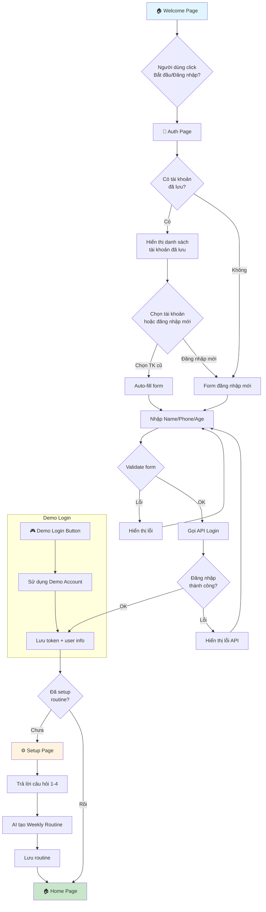
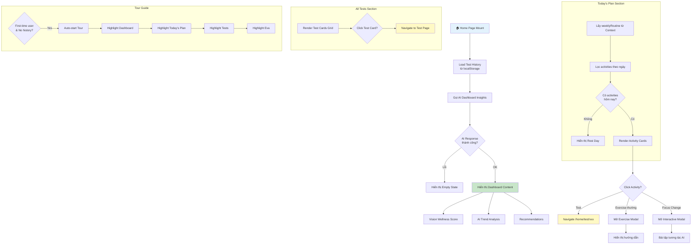
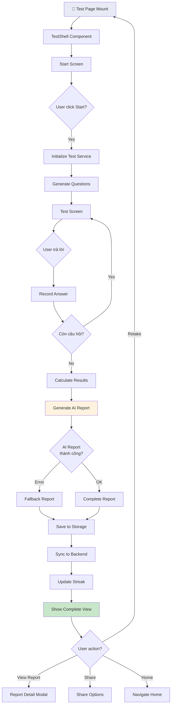
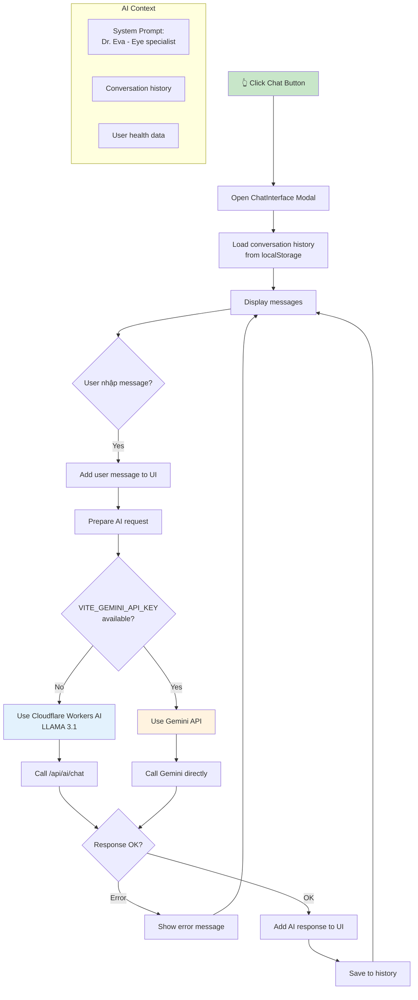
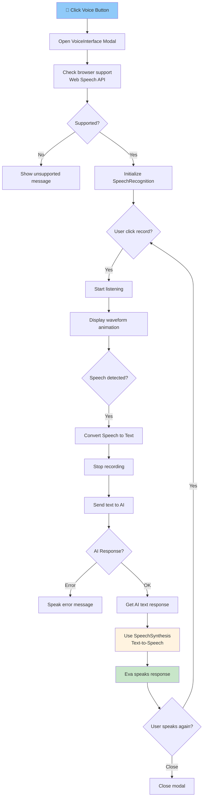
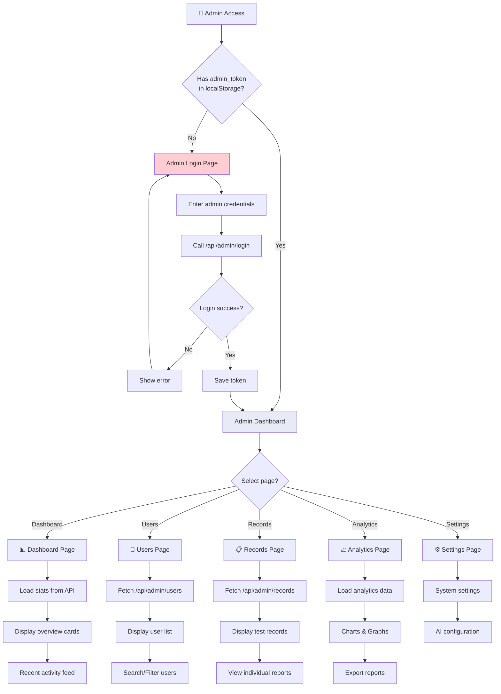
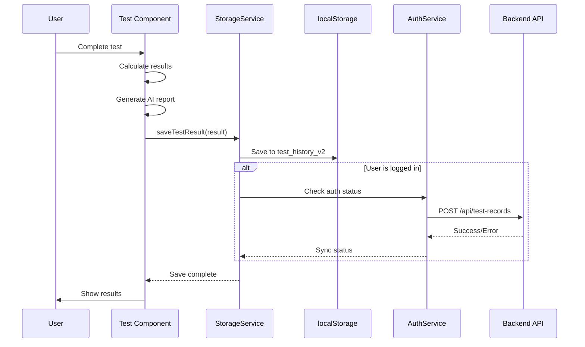

# 📊 Vision Coach - Website Flowcharts

> Tài liệu này mô tả toàn bộ luồng hoạt động của ứng dụng Vision Coach thông qua các sơ đồ flowchart.

---

## 📑 Mục Lục

1. [Tổng Quan Kiến Trúc](#1-tổng-quan-kiến-trúc)
2. [Luồng Xác Thực (Authentication Flow)](#2-luồng-xác-thực)
3. [Luồng Trang Chủ (Home Page Flow)](#3-luồng-trang-chủ)
4. [Luồng Kiểm Tra Thị Lực (Vision Tests Flow)](#4-luồng-kiểm-tra-thị-lực)
5. [Luồng AI Assistant (Eva)](#5-luồng-ai-assistant)
6. [Luồng Admin Dashboard](#6-luồng-admin-dashboard)
7. [Luồng Dữ Liệu (Data Flow)](#7-luồng-dữ-liệu)
8. [Sơ Đồ Các Trang](#8-sơ-đồ-các-trang)

---

## 1. Tổng Quan Kiến Trúc

```
┌─────────────────────────────────────────────────────────────────────────────────┐
│                           VISION COACH ARCHITECTURE                              │
├─────────────────────────────────────────────────────────────────────────────────┤
│                                                                                  │
│  ┌─────────────┐    ┌─────────────┐    ┌─────────────┐    ┌─────────────┐       │
│  │   Landing   │───▶│    Auth     │───▶│    Setup    │───▶│   │     Home     │       │
│  │    Page     │    │    Page     │    │    Page     │    Page     │       │
│  └─────────────┘    └─────────────┘    └─────────────┘    └──────┬──────┘       │
│                                                                   │              │
│                      ┌───────────────────────────────────────────┤              │
│                      │                                           │              │
│                      ▼                                           ▼              │
│  ┌──────────────────────────────────┐    ┌──────────────────────────────────┐   │
│  │         VISION TESTS              │    │         USER FEATURES            │   │
│  │  ┌─────────┐ ┌─────────┐         │    │  ┌─────────┐ ┌─────────┐        │   │
│  │  │ Snellen │ │Colorblnd│         │    │  │ History │ │ Progress│        │   │
│  │  └─────────┘ └─────────┘         │    │  └─────────┘ └─────────┘        │   │
│  │  ┌─────────┐ ┌─────────┐         │    │  ┌─────────┐ ┌─────────┐        │   │
│  │  │Astigmat │ │  Amsler │         │    │  │Reminders│ │ Profile │        │   │
│  │  └─────────┘ └─────────┘         │    │  └─────────┘ └─────────┘        │   │
│  │  ┌─────────┐                     │    │  ┌─────────┐                    │   │
│  │  │Duochrome│                     │    │  │Hospital │                    │   │
│  │  └─────────┘                     │    │  │ Locator │                    │   │
│  └──────────────────────────────────┘    └──────────────────────────────────┘   │
│                                                                                  │
│  ┌──────────────────────────────────────────────────────────────────────────┐   │
│  │                        EVA AI ASSISTANT (Floating)                        │   │
│  │           ┌──────────────┐              ┌──────────────┐                  │   │
│  │           │  Chat Text   │              │  Voice Chat  │                  │   │
│  │           │  (LLAMA 3.1) │              │  (Web Speech)│                  │   │
│  │           └──────────────┘              └──────────────┘                  │   │
│  └──────────────────────────────────────────────────────────────────────────┘   │
│                                                                                  │
│  ┌──────────────────────────────────────────────────────────────────────────┐   │
│  │                           ADMIN DASHBOARD                                 │   │
│  │    ┌──────────┐ ┌──────────┐ ┌──────────┐ ┌──────────┐ ┌──────────┐     │   │
│  │    │Dashboard │ │  Users   │ │ Records  │ │Analytics │ │ Settings │     │   │
│  │    └──────────┘ └──────────┘ └──────────┘ └──────────┘ └──────────┘     │   │
│  └──────────────────────────────────────────────────────────────────────────┘   │
│                                                                                  │
└─────────────────────────────────────────────────────────────────────────────────┘
```

---

## 2. Luồng Xác Thực



### Chi tiết Auth Page Flow:

| Bước | Mô tả | Component |
|------|-------|-----------|
| 1 | Hiển thị form đăng nhập | `AuthPage.tsx` |
| 2 | Validate: Name (2+ ký tự), Phone (10 số), Age (1-120) | `validateForm()` |
| 3 | Gọi API `/api/auth/login` | `authService.loginUser()` |
| 4 | Lưu token vào localStorage | `saveAuthToken()` |
| 5 | Lưu thông tin user vào context | `UserContext` |
| 6 | Redirect theo trạng thái setup | `App.tsx` |

---

## 3. Luồng Trang Chủ



### Dashboard Data Flow:

```
┌─────────────────────────────────────────────────────────────────────┐
│                      HOME PAGE DATA FLOW                             │
├─────────────────────────────────────────────────────────────────────┤
│                                                                      │
│   ┌──────────────┐         ┌──────────────┐         ┌────────────┐ │
│   │   Storage    │────────▶│    Hook      │────────▶│  Dashboard │ │
│   │   Service    │         │useDashboard- │         │  Content   │ │
│   │getTestHistory│         │   Insights   │         │ Component  │ │
│   └──────────────┘         └──────┬───────┘         └────────────┘ │
│                                   │                                 │
│                                   ▼                                 │
│                          ┌──────────────┐                          │
│                          │  AI Service  │                          │
│                          │  (Gemini/    │                          │
│                          │  OpenRouter) │                          │
│                          └──────────────┘                          │
│                                                                      │
│   ┌──────────────┐         ┌──────────────┐         ┌────────────┐ │
│   │   Routine    │────────▶│  useRoutine  │────────▶│  Today's   │ │
│   │   Context    │         │    Hook      │         │   Plan     │ │
│   │ weeklyRoutine│         │              │         │  Section   │ │
│   └──────────────┘         └──────────────┘         └────────────┘ │
│                                                                      │
└─────────────────────────────────────────────────────────────────────┘
```

---

## 4. Luồng Kiểm Tra Thị Lực

### 4.1 Flow Chung Cho Tất Cả Tests



### 4.2 Chi Tiết Từng Loại Test

#### Snellen Test (Thị lực)

```
┌─────────────────────────────────────────────────────────────────────┐
│                         SNELLEN TEST FLOW                           │
├─────────────────────────────────────────────────────────────────────┤
│                                                                     │
│   ADAPTIVE ALGORITHM:                                               │
│   ┌─────────────────────────────────────────────────────────────┐   │
│   │                                                             │   
│   │   Start Level: 5 (20/40)                                    │   
│   │                                                             │   
│   │   ┌───────┐      ┌───────────┐      ┌───────────┐           │   │
│   │   │ Show  │─────▶│User selects│─────▶│  Check    │         │   
│   │   │  "E"  │      │ direction │      │  Answer   │           │   │
│   │   └───────┘      └───────────┘      └─────┬─────┘           │   │
│   │                                           │                  │   │
│   │                    ┌──────────────────────┴──────────────┐  │   │
│   │                    │                                      │  │   │
│   │                    ▼                                      ▼  │   │
│   │           ┌────────────────┐                    ┌──────────┐│   │
│   │           │    CORRECT     │                    │  WRONG   ││   │
│   │           │ correct++ = 2  │                    │ wrong++  ││   │
│   │           │ → Level UP     │                    │ → END    ││   │
│   │           │ (smaller size) │                    │  TEST    ││   │
│   │           └────────────────┘                    └──────────┘│   │
│   │                                                              │   │
│   │   Level Scale: 20/200 → 20/100 → 20/70 → 20/40 → 20/20     │   │
│   │   (9 levels total)                                          │   │
│   │                                                              │   │
│   └─────────────────────────────────────────────────────────────┘   │
│                                                                      │
│   Result Categories:                                                 │
│   • 20/20, 20/25: Excellent (Tuyệt vời)                             │
│   • 20/30, 20/40: Good (Tốt)                                        │
│   • 20/50, 20/70: Fair (Cần chú ý)                                  │
│   • 20/100+: Poor (Cần khám)                                        │
│                                                                      │
└─────────────────────────────────────────────────────────────────────┘
```

#### Color Blind Test (Ishihara)

```
┌─────────────────────────────────────────────────────────────────────┐
│                      COLOR BLIND TEST FLOW                           │
├─────────────────────────────────────────────────────────────────────┤
│                                                                      │
│   20 Ishihara Plates:                                                │
│   ┌─────────────────────────────────────────────────────────────┐   │
│   │                                                              │   │
│   │   Plate 1-5: Demonstration plates                           │   │
│   │   Plate 6-10: Red-Green deficiency                          │   │
│   │   Plate 11-15: Blue-Yellow deficiency                       │   │
│   │   Plate 16-20: Advanced detection                           │   │
│   │                                                              │   │
│   │   For each plate:                                            │   │
│   │   ┌──────────┐     ┌──────────┐     ┌──────────┐            │   │
│   │   │  Display │────▶│User types│────▶│ Compare  │            │   │
│   │   │  Plate   │     │  number  │     │ answer   │            │   │
│   │   └──────────┘     └──────────┘     └────┬─────┘            │   │
│   │                                          │                   │   │
│   │           ┌─────────────────────────────┘                   │   │
│   │           ▼                                                  │   │
│   │   ┌───────────────────────────────────────────┐             │   │
│   │   │ Score Matrix:                              │             │   │
│   │   │ • Correct answer → +1 correct              │             │   │
│   │   │ • Wrong answer → analyze pattern           │             │   │
│   │   │ • Pattern → detect deficiency type         │             │   │
│   │   └───────────────────────────────────────────┘             │   │
│   │                                                              │   │
│   └─────────────────────────────────────────────────────────────┘   │
│                                                                      │
│   Result Types:                                                      │
│   • Normal Vision (Bình thường)                                     │
│   • Protanopia (Mù đỏ)                                              │
│   • Deuteranopia (Mù xanh lá)                                       │
│   • Tritanopia (Mù xanh dương)                                      │
│   • Mild Color Weakness (Yếu màu nhẹ)                               │
│                                                                      │
└─────────────────────────────────────────────────────────────────────┘
```

#### Astigmatism Test

```
┌─────────────────────────────────────────────────────────────────────┐
│                      ASTIGMATISM TEST FLOW                          │
├─────────────────────────────────────────────────────────────────────┤
│                                                                      │
│   Display: Astigmatism Wheel (radial lines)                         │
│   ┌─────────────────────────────────────────────────────────────┐   │
│   │                                                              │   │
│   │   Test each eye separately:                                  │   │
│   │                                                              │   │
│   │   ┌──────────┐     ┌──────────┐     ┌──────────┐            │   │
│   │   │  Show    │────▶│ User     │────▶│  Record  │            │   │
│   │   │  Wheel   │     │ selects  │     │  Answer  │            │   │
│   │   │          │     │ darkest  │     │          │            │   │
│   │   │          │     │ lines    │     │          │            │   │
│   │   └──────────┘     └──────────┘     └──────────┘            │   │
│   │                                                              │   │
│   │   Options:                                                   │   │
│   │   • All lines equal → No astigmatism                        │   │
│   │   • Some darker → Possible astigmatism                      │   │
│   │   • Axis angle detected → Specific type                     │   │
│   │                                                              │   │
│   └─────────────────────────────────────────────────────────────┘   │
│                                                                      │
│   Result Categories:                                                 │
│   • No Astigmatism                                                  │
│   • Mild Astigmatism (axis noted)                                  │
│   • Moderate Astigmatism                                            │
│   • Significant Astigmatism (consultation recommended)              │
│                                                                      │
└─────────────────────────────────────────────────────────────────────┘
```

#### Amsler Grid Test

```
┌─────────────────────────────────────────────────────────────────────┐
│                       AMSLER GRID TEST FLOW                          │
├─────────────────────────────────────────────────────────────────────┤
│                                                                      │
│   Display: Grid with central dot                                    │
│   ┌─────────────────────────────────────────────────────────────┐   │
│   │                                                              │   │
│   │   Instructions:                                              │   │
│   │   1. Cover one eye                                           │   │
│   │   2. Focus on central dot                                    │   │
│   │   3. Report any distortions                                  │   │
│   │                                                              │   │
│   │   Questions for each eye:                                    │   │
│   │   ┌─────────────────────────────────────────┐               │   │
│   │   │ Q1: Có thấy điểm đen trung tâm?         │               │   │
│   │   │ Q2: Các đường có thẳng không?           │               │   │
│   │   │ Q3: Có vùng mờ hoặc trống không?        │               │   │
│   │   │ Q4: Có vùng bị uốn cong không?          │               │   │
│   │   └─────────────────────────────────────────┘               │   │
│   │                                                              │   │
│   └─────────────────────────────────────────────────────────────┘   │
│                                                                      │
│   Result Interpretation:                                            │
│   • Normal: All lines straight, center visible, no gaps            │
│   • Abnormal: Wavy lines, blind spots, distortions                 │
│   → May indicate macular degeneration (Thoái hóa điểm vàng)        │
│                                                                      │
└─────────────────────────────────────────────────────────────────────┘
```

#### Duochrome Test

```
┌─────────────────────────────────────────────────────────────────────┐
│                       DUOCHROME TEST FLOW                           │
├─────────────────────────────────────────────────────────────────────┤
│                                                                      │
│   Display: Red-Green split screen with optotypes                    │
│   ┌─────────────────────────────────────────────────────────────┐   │
│   │                                                              │   │
│   │   ┌─────────────┬─────────────┐                              │   │
│   │   │    RED      │    GREEN    │                              │   │
│   │   │   (Left)    │   (Right)   │                              │   │
│   │   │             │             │                              │   │
│   │   │    Text     │    Text     │                              │   │
│   │   │             │             │                              │   │
│   │   └─────────────┴─────────────┘                              │   │
│   │                                                              │   │
│   │   Question: Which side is clearer?                           │   │
│   │   • Red side → Overcorrected (farsighted tendency)          │   │
│   │   • Green side → Undercorrected (nearsighted tendency)      │   │
│   │   • Equal → Correct prescription                            │   │
│   │                                                              │   │
│   └─────────────────────────────────────────────────────────────┘   │
│                                                                      │
│   Purpose: Check if current glasses prescription is accurate       │
│                                                                      │
└─────────────────────────────────────────────────────────────────────┘
```

---

## 5. Luồng AI Assistant

### 5.1 Chat Interface Flow



### 5.2 Voice Interface Flow



---

## 6. Luồng Admin Dashboard



---

## 7. Luồng Dữ Liệu

### 7.1 Data Storage Architecture

```
┌─────────────────────────────────────────────────────────────────────────────┐
│                           DATA STORAGE LAYERS                                │
├─────────────────────────────────────────────────────────────────────────────┤
│                                                                              │
│   ┌──────────────────────────────────────────────────────────────────────┐ │
│   │                        CLIENT LAYER                                   │ │
│   │                                                                       │ │
│   │   localStorage                    │  React Context                   │ │
│   │   ├─ test_history_v2              │  ├─ UserContext (auth)           │ │
│   │   ├─ user_auth_v2                 │  ├─ RoutineContext (weekly)      │ │
│   │   ├─ weekly_routine               │  ├─ LanguageContext (i18n)       │ │
│   │   ├─ completed_activities         │  ├─ ThemeContext (dark/light)    │ │
│   │   ├─ eva_chat_history             │  └─ TourGuideContext             │ │
│   │   ├─ reminders                    │                                   │ │
│   │   ├─ streak_data                  │                                   │ │
│   │   └─ admin_token                  │                                   │ │
│   │                                                                       │ │
│   └──────────────────────────────────────────────────────────────────────┘ │
│                                        │                                    │
│                                        ▼                                    │
│   ┌──────────────────────────────────────────────────────────────────────┐ │
│   │                        SYNC LAYER                                     │ │
│   │                                                                       │ │
│   │   StorageService                                                      │ │
│   │   ├─ saveTestResult() ─────────────────────┐                         │ │
│   │   ├─ getTestHistory()                       │                         │ │
│   │   └─ clearHistory()                         │                         │ │
│   │                                             │                         │ │
│   │   authService                               │                         │ │
│   │   ├─ syncUserData() ◄──────────────────────┤                         │ │
│   │   └─ getTestHistory(userId)                 │                         │ │
│   │                                             ▼                         │ │
│   └─────────────────────────────────────────────────────────────────────┘ │
│                                        │                                    │
│                                        ▼                                    │
│   ┌──────────────────────────────────────────────────────────────────────┐ │
│   │                        BACKEND LAYER                                  │ │
│   │                                                                       │ │
│   │   Cloudflare Workers                           Cloudflare D1          │ │
│   │   ├─ /api/auth/login ──────────────────────▶ ├─ users table          │ │
│   │   ├─ /api/test-records ────────────────────▶ ├─ test_records table   │ │
│   │   ├─ /api/ai/report ───────────────────────▶ ├─ ai_reports table     │ │
│   │   ├─ /api/admin/* ─────────────────────────▶ └─ admin_logs table     │ │
│   │   │                                                                   │ │
│   │   │                            External APIs                          │ │
│   │   ├─ /api/ai/chat ─────────────────────────▶ Cloudflare Workers AI   │ │
│   │   └─ Direct calls ─────────────────────────▶ Google Gemini API       │ │
│   │                                                                       │ │
│   └──────────────────────────────────────────────────────────────────────┘ │
│                                                                              │
└─────────────────────────────────────────────────────────────────────────────┘
```

### 7.2 Test Result Sync Flow



---

## 8. Sơ Đồ Các Trang

### 8.1 Navigation Map

```
┌─────────────────────────────────────────────────────────────────────────────┐
│                           PAGE NAVIGATION MAP                                │
├─────────────────────────────────────────────────────────────────────────────┤
│                                                                              │
│   PUBLIC ROUTES (No auth required)                                          │
│   ┌─────────────────────────────────────────────────────────────────────┐   │
│   │                                                                      │   │
│   │   /                           /login                                 │   │
│   │   ┌──────────────┐           ┌──────────────┐                       │   │
│   │   │ WelcomePage  │──────────▶│   AuthPage   │                       │   │
│   │   │ (Landing)    │           │ (Login/Reg)  │                       │   │
│   │   └──────────────┘           └──────┬───────┘                       │   │
│   │                                      │                               │   │
│   │                                      ▼                               │   │
│   │                              /setup                                  │   │
│   │                              ┌──────────────┐                       │   │
│   │                              │Personalized- │                       │   │
│   │                              │  SetupPage   │                       │   │
│   │                              └──────┬───────┘                       │   │
│   │                                      │                               │   │
│   └──────────────────────────────────────┼──────────────────────────────┘   │
│                                          │                                   │
│   PROTECTED ROUTES (Auth required)       │                                   │
│   ┌──────────────────────────────────────┼──────────────────────────────┐   │
│   │                                      ▼                               │   │
│   │   /home                                                              │   │
│   │   ┌──────────────┐                                                  │   │
│   │   │     Home     │                                                  │   │
│   │   │  (Dashboard) │                                                  │   │
│   │   └──────┬───────┘                                                  │   │
│   │          │                                                           │   │
│   │   ┌──────┴───────┬───────────┬───────────┬───────────┐              │   │
│   │   │              │           │           │           │              │   │
│   │   ▼              ▼           ▼           ▼           ▼              │   │
│   │   /home/test/*   /home/      /home/      /home/      /home/         │   │
│   │                  history     progress    reminders   profile        │   │
│   │   ┌─────────┐   ┌────────┐  ┌────────┐  ┌────────┐  ┌────────┐     │   │
│   │   │ Tests:  │   │History │  │Progress│  │Remind- │  │Health  │     │   │
│   │   │•snellen │   │  Page  │  │  Page  │  │  ers   │  │Profile │     │   │
│   │   │•colorblnd│  │        │  │        │  │        │  │        │     │   │
│   │   │•astigmat│   └────────┘  └────────┘  └────────┘  └────────┘     │   │
│   │   │•amsler  │                                                       │   │
│   │   │•duochrom│   /home/hospitals                                     │   │
│   │   └─────────┘   ┌──────────────┐                                   │   │
│   │                 │  Hospital    │                                    │   │
│   │                 │   Locator    │                                    │   │
│   │                 └──────────────┘                                   │   │
│   │                                                                      │   │
│   │   /home/admin                                                        │   │
│   │   ┌──────────────────────────────────────────────────────┐          │   │
│   │   │                    Admin Dashboard                    │          │   │
│   │   │   ┌─────────┐ ┌─────────┐ ┌─────────┐ ┌─────────┐   │          │   │
│   │   │   │Dashboard│ │ Users   │ │ Records │ │Analytics│   │          │   │
│   │   │   └─────────┘ └─────────┘ └─────────┘ └─────────┘   │          │   │
│   │   └──────────────────────────────────────────────────────┘          │   │
│   │                                                                      │   │
│   └──────────────────────────────────────────────────────────────────────┘   │
│                                                                              │
└─────────────────────────────────────────────────────────────────────────────┘
```

### 8.2 Page Details

| Route | Component | Mục đích |
|-------|-----------|----------|
| `/` | `WelcomePage` | Landing page với hero, features, CTA |
| `/login` | `AuthPage` | Đăng nhập/Đăng ký với Name/Phone/Age |
| `/setup` | `PersonalizedSetupPage` | Setup weekly routine với AI |
| `/home` | `Home` | Dashboard chính, Today's Plan, All Tests |
| `/home/history` | `History` | Lịch sử các bài test đã làm |
| `/home/progress` | `ProgressPage` | Biểu đồ tiến trình, AI insights |
| `/home/reminders` | `RemindersPage` | Nhắc nhở, streak, badges |
| `/home/profile` | `HealthProfile` | Hồ sơ sức khỏe mắt |
| `/home/hospitals` | `HospitalLocator` | Tìm bệnh viện mắt gần nhất |
| `/home/test/snellen` | `SnellenTest` | Test thị lực Snellen |
| `/home/test/colorblind` | `ColorBlindTest` | Test mù màu Ishihara |
| `/home/test/astigmatism` | `AstigmatismTest` | Test loạn thị |
| `/home/test/amsler` | `AmslerGridTest` | Test lưới Amsler |
| `/home/test/duochrome` | `DuochromeTest` | Test Duochrome |
| `/home/admin` | `AdminApp` | Admin panel quản lý |

---

## 📝 Ghi Chú Kỹ Thuật

### Context Providers Hierarchy

```jsx
<ErrorBoundary>
  <ThemeProvider>
    <LanguageProvider>
      <RoutineProvider>
        <UserProvider>
          <VoiceControlProvider>
            <TourGuideProvider>
              <HashRouter>
                <App />
              </HashRouter>
            </TourGuideProvider>
          </VoiceControlProvider>
        </UserProvider>
      </RoutineProvider>
    </LanguageProvider>
  </ThemeProvider>
</ErrorBoundary>
```

### Key Services

| Service | File | Chức năng |
|---------|------|-----------|
| `StorageService` | `services/storageService.ts` | Quản lý localStorage |
| `AIService` | `services/aiService.ts` | Gọi AI APIs (Gemini/OpenRouter) |
| `AuthService` | `services/authService.ts` | Authentication & user data |
| `SnellenTestService` | `services/snellenTestService.ts` | Logic test Snellen |
| `ColorBlindTestService` | `services/colorBlindTestService.ts` | Logic test mù màu |
| `ReminderService` | `services/reminderService.ts` | Nhắc nhở & gamification |

---

*Tài liệu được tạo tự động bởi Antigravity AI Assistant*
*Cập nhật lần cuối: 2025-12-11*
